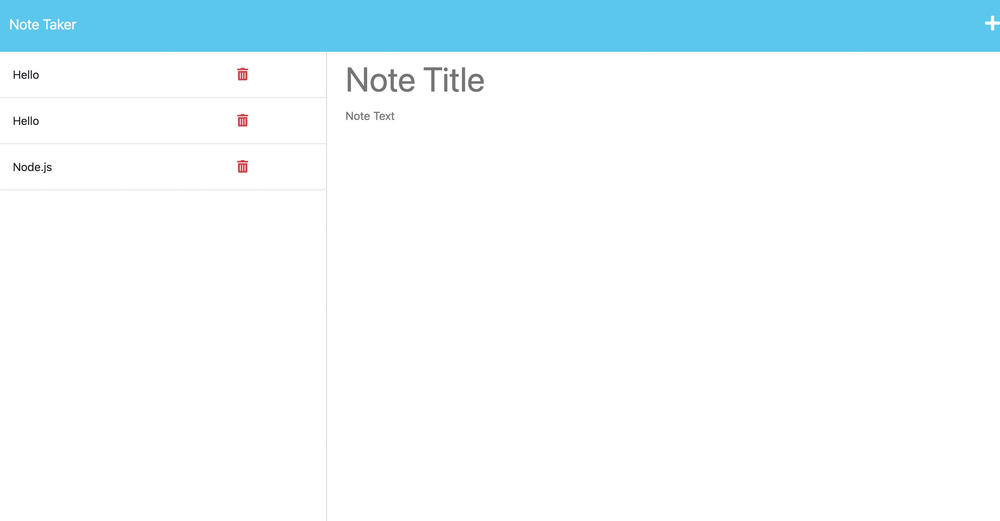

# DCC Note Taker

## Link to deployed application
https://dcc-notetaker.herokuapp.com/

## Table of Contents: 
[Description](#description)

[Installation](#installation)

[Usage](#usage)

[Contributions](#contributions)

[License](#license)

[Questions](#questions)

[Screenshot](#screenshot)

## Description: 
This is a a full stack application complete with front and back end elements that allows users to save notes on a server and view them later.

## Installation: 
No installation instuctions

## Usage: 
This application can be used to create notes with headings and bodies. The notes can then be saved to a column on the left hand side of the page.

## Contributions: 
Jacob Pedigo, Nic Catania, Joem Casusi, Julio Valdez

## License:
None Applicable

## Questions: 
Github Username: https://github.com/darthcurtiscass

Email: dylancurtiscassagnol@icloud.com

## Screenshot

